# Agentic Data Migration Planner and Reconciliation Workbench

A full-stack, production-grade workbench designed to plan, validate, review, approve, execute, reconcile, and safely rollback the migration of bounded datasets from a legacy source schema to a modernized target schema.

The application combines **advisory AI agents** (for schema semantic mapping, compatibility evaluation, and risk detection) with a **strict deterministic execution engine** (for schema validation, idempotency, quarantine isolation, atomic transactions, count reconciliation, and rollback).

---

## Architecture & Principles

### Core Safety Principle
```text
           ┌────────────────────────┐
           │   Source & Target      │
           │  Schemas + Sample Data │
           └───────────┬────────────┘
                       │
                       ▼
           ┌────────────────────────┐
           │      AI Agent          │
           │ (Advisory Mapping/Risk)│
           └───────────┬────────────┘
                       │
                       ▼
        ╔══════════════════════════════╗
        ║    HUMAN APPROVAL GATE       ║ ◄── Plan CANNOT execute
        ║  (Inspect, Edit, Approve)    ║     without explicit human sign-off
        ╚══════════════════════════════╝
                       │
                       ▼
           ┌────────────────────────┐
           │ Deterministic Backend  │
           │  - Validation (Zod)    │
           │  - Dry Runs            │
           │  - Transformation Reg. │
           │  - Quarantine Isolation│
           │  - Idempotency Keys    │
           │  - Reconciliation      │
           │  - Selective Rollback  │
           └────────────────────────┘
```

### Full-Stack System Architecture

```mermaid
graph TD
    subgraph Frontend ["Frontend (React + Vite + Tailwind CSS)"]
        UI[Workbench Dashboard & Review UI]
        RQ[TanStack Query State & Cache]
        RHF[React Hook Form + Zod]
    end

    subgraph Backend ["Backend (Express.js + Node.js)"]
        API[REST API Layer & Helmet Security]
        Pino[Pino Structured Logger]
        
        subgraph AIServiceSub ["AI Service Abstraction"]
            AISvc[AIService]
            Gemini[GeminiProvider]
            OpenAI[OpenAIProvider]
            Mock[MockProvider Offline Fallback]
            ZodAI[Strict Zod Output Validation]
        end

        subgraph DeterministicEngine ["Deterministic Migration Engine"]
            TransReg[TransformationRegistry]
            ValEngine[Deterministic Schema Validator]
            IdemKey[Idempotency & Duplicate Prevention]
            Reconciler[Count Reconciler & Invariant Checker]
            RollbackEng[Selective Rollback Engine]
        end
    end

    subgraph Database ["Persistence Layer (MongoDB / Mongoose)"]
        Mongo[(MongoDB / In-Memory Fallback)]
        Projects[MigrationProjects]
        Plans[Versioned MigrationPlans]
        Runs[MigrationRuns]
        Quarantine[QuarantinedRecords]
        Target[TargetCustomer Collection]
        Audit[AuditLogs Timeline]
    end

    UI --> API
    API --> AISvc
    AISvc --> Gemini
    AISvc --> OpenAI
    AISvc --> Mock
    AISvc --> ZodAI

    API --> ValEngine
    API --> TransReg
    API --> IdemKey
    API --> Reconciler
    API --> RollbackEng

    ValEngine --> Quarantine
    IdemKey --> Target
    RollbackEng --> Target
    API --> Mongo
```



---

## Core Product Workflow

1. **Source & Target Schema Definition**: Configures bounded source (`legacy_customers`) and target (`customers`) fields, types, and constraints.
2. **AI Semantic Analysis**: Evaluates field naming patterns, data types, and sample records. Outputs strict JSON with proposed mappings, transformation functions, confidence scores, compatibility risks, and clarification questions.
3. **Structured Validation**: AI output is strictly validated against a Zod schema before presentation. Malformed responses or unsupported transformations are rejected immediately.
4. **Human Review & Approval Gate**: The human operator inspects confidence, edits mappings, changes transformations, resolves clarification questions, and provides an explicit sign-off. Execution is impossible in `DRAFT` or `PENDING_REVIEW` states.
5. **Plan Versioning**: Every manual modification generates a new sequential version (`v1` -> `v2` -> `v3`). Changing an approved plan immediately reverts the new version to `PENDING_REVIEW` to prevent unauthorized execution.
6. **Deterministic Dry Run**: Evaluates transformations and schema constraints against sample records without mutating the target database. Provides field-level error evidence and reconciliation summaries.
7. **Idempotent Migration Execution**: Writes accepted records into the target collection with deterministic idempotency keys (`cust_<id>`). Re-running or retrying migration does not duplicate records.
8. **Quarantine Isolation**: Malformed records (e.g. invalid emails, missing required fields, unparseable dates) are isolated in `QuarantinedRecords` with the original source record, failed field, value, and violated rule.
9. **Deterministic Reconciliation**: Evaluates mathematical invariants:
   - $\text{Source Records} = \text{Accepted} + \text{Rejected}$
   - $\text{Target Inserts} = \text{Accepted} - \text{Duplicates}$
10. **Selective Rollback**: Deletes *only* records ingested during that specific migration run, marks the run `ROLLED_BACK`, and prevents unsafe repeated rollbacks.

---

## Supported Transformations

The application prohibits arbitrary executable code generated by LLMs. Only deterministic functions registered in the `TransformationRegistry` are allowed:

| Transformation | Behavior |
| :--- | :--- |
| `DIRECT` | Returns value unmodified. |
| `STRING_TRIM` | Trims leading and trailing whitespace. |
| `LOWERCASE` | Converts strings to lowercase and trims. |
| `UPPERCASE` | Converts strings to uppercase and trims. |
| `STRING_TO_NUMBER` | Safely parses numeric representations into valid numbers. |
| `NUMBER_TO_STRING` | Converts numbers into clean strings. |
| `DATE_ISO` / `DATE_TO_ISO` | Normalizes legacy date formats to standardized ISO-8601 (`YYYY-MM-DD`). |
| `BOOLEAN_NORMALIZE` | Maps `true`, `1`, `yes`, `false`, `0`, `no` into standard booleans. |
| `NULL_TO_DEFAULT` | Replaces null or empty values with configured fallback strings. |
| `SPLIT_FULL_NAME` | Deterministically splits full names into first and last name components. |

---

## Getting Started

### Prerequisites

- **Node.js**: v18+ (tested on Node v24.19.0)
- **npm**: v9+ (tested on npm 11.17.0)
- **MongoDB**: Standalone MongoDB instance or MongoDB Atlas. *(Note: If MongoDB is not running locally, the application automatically launches an embedded in-memory MongoDB server for instant zero-config evaluation).*

### Installation

Clone the repository and install all dependencies:

```bash
git clone <repo-url>
cd "Agentic Data Migration Planner and Reconciliation Workbench"
npm install
```

### Environment Configuration

Copy `.env.example` to `.env`:

```bash
cp .env.example .env
```

Default `.env` configuration:
```env
NODE_ENV=development
PORT=5000
MONGODB_URI=mongodb://localhost:27017/migration_workbench
CORS_ORIGIN=http://localhost:5173
LOG_LEVEL=info

# AI Provider (Optional: if empty, high-fidelity MockProvider runs offline automatically)
LLM_PROVIDER=gemini
LLM_API_KEY=
LLM_MODEL=gemini-1.5-flash
LLM_BASE_URL=
```

### Database Seeding

Populate the database with the reference project and 100 sample records (including valid records, whitespace variations, invalid emails, missing required fields, and duplicate IDs):

```bash
npm run seed
```

### Running Locally

To run both the backend API and frontend Vite development server concurrently:

```bash
npm run dev
```

Or run them individually in separate terminals:

```bash
# Backend server (port 5000)
npm run dev:server

# Frontend client (port 5173)
npm run dev:client
```

Access the UI at: **http://localhost:5173**  
API Health endpoint: **http://localhost:5000/api/health**

---

## Testing & Quality Assurance

The test suite covers transformations, validation rules, migration idempotency, human approval gating, rollback safety, and AI output validation:

```bash
# Run all unit and integration test suites
npm test

# Run tests with coverage
npm run test:coverage

# Run production build validation
npm run build
```

### Test Coverage Highlights

- **`transformations.test.js`**: Verifies all 11 deterministic transformation registry functions and confirms illegal transformations are rejected.
- **`validator.test.js`**: Tests required field checks, RFC email validations, date parsing, and type enforcement.
- **`approval.test.js`**: Proves that unapproved or rejected plans cannot be executed, and verifies that editing an approved plan reverts the new version to `PENDING_REVIEW`.
- **`migration.test.js`**: Tests dry runs, full execution, quarantine storage, duplicate prevention, and retry idempotency.
- **`rollback.test.js`**: Validates that rollback only touches records created by that specific run and blocks repeated rollback attempts.
- **`ai.test.js`**: Mocks the LLM, validates structured JSON schemas with Zod, and verifies automatic fallback on provider failure.
- **`api.test.js`**: Integration tests across Express REST endpoints.

---

## REST API Reference

| Method | Endpoint | Description |
| :--- | :--- | :--- |
| `GET` | `/api/health` | System health and database connectivity status. |
| `GET` | `/api/projects` | List all migration projects with summary statistics. |
| `POST` | `/api/projects` | Create a new bounded migration project. |
| `GET` | `/api/projects/:id` | Get project details, source/target schemas, and sample records. |
| `POST` | `/api/projects/:id/ai/analyze` | Trigger AI analysis to generate a new versioned migration plan. |
| `GET` | `/api/plans/:id` | Retrieve migration plan version with mappings and risks. |
| `PUT` | `/api/plans/:id` | Submit user edits; creates a new sequential plan version. |
| `POST` | `/api/plans/:id/approve` | Human operator approves migration plan for execution. |
| `POST` | `/api/plans/:id/reject` | Reject migration plan with reason. |
| `POST` | `/api/plans/:id/dry-run` | Execute deterministic dry run against sample records. |
| `POST` | `/api/plans/:id/execute` | Execute approved migration plan into target store. |
| `GET` | `/api/runs/:id` | Get execution diagnostics, metrics, and reconciliation state. |
| `POST` | `/api/runs/:id/rollback` | Perform selective rollback of records inserted by run. |
| `GET` | `/api/runs/:id/quarantine` | Paginated inspection of quarantined records with field errors. |
| `GET` | `/api/projects/:id/history` | Audit trail of all plan modifications, approvals, and runs. |
| `GET` | `/api/dashboard/stats` | Global dashboard statistics and recent activity stream. |

---

## Deployment Guide

### Backend (e.g. Render / Railway / Heroku)
1. Set the root directory or configure workspace to `server`.
2. Build command: `npm install`
3. Start command: `node src/app.js`
4. Configure environment variables (`MONGODB_URI`, `PORT=5000`, `CORS_ORIGIN`, `LLM_API_KEY`).

### Frontend (e.g. Vercel / Netlify)
1. Set root directory to `client`.
2. Build command: `npm run build`
3. Output directory: `dist`
4. Set environment variable: `VITE_API_URL` (or configure reverse proxy to backend).

### Database (MongoDB Atlas)
1. Provision a free M0 cluster on MongoDB Atlas.
2. Whitelist application IP / CIDR block `0.0.0.0/0`.
3. Set `MONGODB_URI` connection string in environment variables.

---

## Completed Scope vs. Excluded Scope

### Completed Scope
- [x] Full interactive dashboard with metrics, active projects, and audit feed.
- [x] Schema inspection for source (`legacy_customers`) and target (`customers`).
- [x] Deterministic 100-record seed data with edge cases (invalid email, missing required fields, bad dates, duplicates).
- [x] AI analysis agent proposing field mappings, confidence, risks, and clarification questions.
- [x] Strict Zod schema validation of LLM outputs; rejection of invalid transformations.
- [x] Dedicated Human Review Workbench with inline mapping edits and transformation dropdowns.
- [x] Migration plan versioning (`v1` -> `v2` -> `v3`); edits reset approval status.
- [x] Mandatory Human Approval Gating prior to execution.
- [x] Deterministic dry run with error evidence and sample preview.
- [x] Idempotent migration execution with stable idempotency keys (`cust_<id>`).
- [x] Quarantine database store and inspection UI for rejected records.
- [x] Deterministic count reconciliation verifying exact mathematical invariants.
- [x] Selective rollback removing only records inserted by that run, with repeated rollback guard.
- [x] Structured JSON logging via Pino without exposing credentials.
- [x] Zero-config in-memory MongoDB fallback for instant evaluation.

### Excluded Scope (Intentionally Out of Scope)
- Multiple concurrent source/target database connectors (e.g. live Oracle/Postgres CDC).
- Distributed queue workers (e.g. Kafka, Celery) — bounded to 1,000 records.
- Arbitrary code generation/execution from LLMs.
- Multi-tenant enterprise authentication systems.
- Streaming real-time replication.

---

## Limitations

1. **Sample Size**: Tailored for bounded dataset migration up to 1,000 sample records per batch.
2. **Target Schema Constraints**: Validates against single-level flat and nested object models rather than relational foreign-key cascades across multiple tables.
3. **Rollback Granularity**: Rollback is record-level based on IDs tracked during the migration run. If records were subsequently updated by third-party systems post-migration, rollback deletes the record entirely.
