# Agentic Data Migration Planner and Reconciliation Workbench

[](#testing--quality-assurance)
[](#architecture--principles)
[%20%7C%20Gemini%20%7C%20OpenAI%20%7C%20Offline-orange.svg)](#ai-provider-matrix)
[](#supported-transformations)
[](#the-4-standout-enterprise-features)

A full-stack, enterprise-grade workbench designed to plan, validate, review, approve, execute, reconcile, and safely rollback the migration of bounded datasets from a legacy source schema to a modernized target schema.

The application combines **advisory AI agents** (for schema semantic mapping, compatibility evaluation, and risk detection) with a **strict deterministic execution engine** (for schema validation, idempotency, quarantine isolation, atomic transactions, count reconciliation, and rollback).

---

## Table of Contents

- [Architecture & Principles](#architecture--principles)
- [The 4 Standout Enterprise Features](#the-4-standout-enterprise-features)
- [AI Provider Matrix & OpenRouter Free Tier](#ai-provider-matrix)
- [Core Product Workflow](#core-product-workflow)
- [Supported Transformations](#supported-transformations)
- [Getting Started](#getting-started)
- [Testing & Quality Assurance](#testing--quality-assurance)
- [REST API Reference](#rest-api-reference)
- [Deployment Guide](#deployment-guide)
- [Evaluation & Architectural Defense](#evaluation--architectural-defense)
- [Completed Scope vs. Excluded Scope](#completed-scope-vs-excluded-scope)
- [Limitations](#limitations)

---

## Architecture & Principles

### Core Safety Principle

```text
           ┌────────────────────────┐
           │   Source & Target      │
           │  Schemas + Sample Data │
           └───────────┬────────────┘
                       │
                       ▼
           ┌────────────────────────┐
           │   Advisory AI Agent    │
           │ (OpenRouter / Gemini / │
           │  OpenAI / Mock Engine) │
           └───────────┬────────────┘
                       │
                       ▼
        ╔══════════════════════════════╗
        ║    HUMAN APPROVAL GATE       ║ ◄── Plan CANNOT execute
        ║  (Inspect, Edit, Approve)    ║     without explicit human sign-off
        ╚══════════════════════════════╝
                       │
                       ▼
           ┌────────────────────────┐
           │ Deterministic Backend  │
           │  - Strict Zod Schema   │
           │  - 0-Write Dry Runs    │
           │  - Transformation Reg. │
           │  - Quarantine Store    │
           │  - Idempotency Hash    │
           │  - Exact Reconciliation│
           │  - Selective Rollback  │
           └────────────────────────┘
```

### Full-Stack System Architecture

```mermaid
graph TD
    subgraph Frontend ["Frontend (React 18 + Vite + Tailwind CSS)"]
        UI[Workbench Dashboard & Catalog UI]
        Sandbox[Live Record Transformation Sandbox]
        Chaos[Synthetic Chaos Dataset Injector]
        Cert[SOC 2 / ISO 27001 Certificate Generator]
        Tour[6-Stage Governance Tour]
        RQ[TanStack Query State & Cache]
    end

    subgraph Backend ["Backend (Node.js + Express.js)"]
        API[REST API Layer & Helmet Security]
        Pino[Pino Structured Logger & Correlation IDs]
        
        subgraph AIServiceSub ["AI Service Abstraction & Fallback"]
            AISvc[AIService Orchestrator]
            OpenRouter[OpenRouter Free Tier Provider]
            Gemini[Gemini 1.5 Provider]
            OpenAI[OpenAI Provider]
            Mock[Deterministic MockProvider Fallback]
            Normalizer[Schema Normalizer & Key Sanitizer]
            ZodAI[Strict Zod Output Validation]
        end

        subgraph DeterministicEngine ["Deterministic Migration Engine"]
            TransReg[TransformationRegistry - Whitelisted]
            ValEngine[Deterministic Schema Validator]
            IdemKey[Idempotency & Duplicate Prevention]
            Reconciler[Count Reconciler & Invariant Checker]
            RollbackEng[Selective Rollback Engine]
        end
    end

    subgraph Database ["Persistence Layer (MongoDB / Mongoose)"]
        Mongo[(MongoDB / In-Memory Fallback)]
        Projects[MigrationProjects]
        Plans[Versioned MigrationPlans]
        Runs[MigrationRuns]
        Quarantine[QuarantinedRecords]
        Target[TargetCustomer Collection]
        Audit[AuditLogs Timeline]
    end

    UI --> API
    Sandbox --> API
    API --> AISvc
    AISvc --> OpenRouter
    AISvc --> Gemini
    AISvc --> OpenAI
    AISvc --> Mock
    AISvc --> Normalizer
    Normalizer --> ZodAI

    API --> ValEngine
    API --> TransReg
    API --> IdemKey
    API --> Reconciler
    API --> RollbackEng

    ValEngine --> Quarantine
    IdemKey --> Target
    RollbackEng --> Target
    API --> Mongo
```



---

## The 4 Standout Enterprise Features

To elevate this project beyond standard assessment submissions, the workbench incorporates four production-grade enterprise capabilities:

### 1. Live Record Transformation Sandbox
Located on the **Plan Review & Mapping Workbench**, this interactive console lets operators paste or modify raw JSON records and immediately observe how the deterministic transformation rules evaluate them in real time *before* approving the plan.

### 2. Synthetic Chaos Dataset Injector
Located on the **Project Detail Workspace**, operators can inject edge-case test records with a single click (malformed RFC emails, null values, corrupted ISO dates, trailing whitespace, and SQL/script injection attempts) to prove that the validation engine and quarantine store isolate corrupt rows without crashing.

### 3. Downloadable SOC 2 Type II / ISO 27001 Compliance Certificate Pack
Located on the **Run Diagnostics & Reconciliation Workspace**, operators can export a cryptographically signed compliance manifest (JSON) containing exact row checksums, operator attribution, pre/post reconciliation balance, and approval timestamps for enterprise audit readiness.

### 4. Interactive 6-Stage Governance Tour
Accessible directly from the **Executive Overview Dashboard**, this interactive guide visually walks evaluators through the entire bounded governance lifecycle: Schema Discovery $\to$ AI Advisory Planning $\to$ Deterministic Dry Run $\to$ Human Signoff $\to$ Idempotent Execution $\to$ Dual Reconciliation & Rollback.

---

## AI Provider Matrix

The workbench uses an adaptable multi-provider architecture designed to ensure zero downtime regardless of API key availability or upstream rate limits:

| Provider | Model Tested | Status | Notes |
| :--- | :--- | :--- | :--- |
| **OpenRouter (Free)** | `openrouter/free` / `liquid/lfm-2.5-2.6b:free` | Supported | Free tier open-source router with automated schema normalization & 25s timeout safeguard. |
| **Google Gemini** | `gemini-1.5-flash` / `gemini-2.0-flash` | Supported | Fast, highly accurate structured JSON generation via Google AI Studio. |
| **OpenAI** | `gpt-4o-mini` / `gpt-4o` | Supported | Native JSON Schema response format. |
| **Offline Fallback** | `MockProvider` | Built-in | Deterministic offline provider. Zero API keys or internet connection required; activates automatically. |

### Schema Normalization & Guardrails
Free open-source models occasionally return slight variations in key casing (e.g. `fieldMappings` instead of `mappings` or string-only risk arrays). The `AIService` includes a **Schema Normalizer** that cleans, maps aliases (e.g. `TRIM` $\to$ `STRING_TRIM`), and validates the payload through Zod schemas before presenting it to the operator.

---

## Core Product Workflow

1. **Source & Target Schema Definition**: Configures bounded source (`legacy_customers`) and target (`customers`) fields, types, and constraints.
2. **AI Semantic Analysis**: Evaluates field naming patterns, data types, and sample records. Outputs strict JSON with proposed mappings, transformation functions, confidence scores, compatibility risks, and clarification questions.
3. **Structured Validation**: AI output is strictly validated against a Zod schema. Malformed responses or unsupported transformations are rejected immediately.
4. **Human Review & Approval Gate**: The human operator inspects confidence, edits mappings, changes transformations, resolves clarification questions, and provides an explicit sign-off. Execution is impossible in `DRAFT` or `PENDING_REVIEW` states.
5. **Plan Versioning**: Every manual modification generates a new sequential version (`v1` $\to$ `v2` $\to$ `v3`). Changing an approved plan immediately reverts the new version to `PENDING_REVIEW` to prevent unauthorized execution.
6. **Deterministic Dry Run**: Evaluates transformations and schema constraints against sample records without mutating the target database. Provides field-level error evidence and reconciliation summaries.
7. **Idempotent Migration Execution**: Writes accepted records into the target collection with deterministic idempotency keys (`cust_<id>`). Re-running or retrying migration does not duplicate records.
8. **Quarantine Isolation**: Malformed records (e.g. invalid emails, missing required fields, unparseable dates) are isolated in `QuarantinedRecords` with the original source record, failed field, value, and violated rule.
9. **Deterministic Reconciliation**: Evaluates mathematical invariants:
   - $\text{Source Records} = \text{Accepted} + \text{Rejected}$
   - $\text{Target Inserts} = \text{Accepted} - \text{Duplicates}$
10. **Selective Rollback**: Deletes *only* records ingested during that specific migration run, marks the run `ROLLED_BACK`, and prevents unsafe repeated rollbacks.

---

## Supported Transformations

Arbitrary code execution generated by LLMs is strictly prohibited. Only deterministic functions registered in the `TransformationRegistry` are permitted:

| Transformation | Behavior |
| :--- | :--- |
| `DIRECT` | Returns value unmodified. |
| `STRING_TRIM` | Trims leading and trailing whitespace. |
| `LOWERCASE` | Converts strings to lowercase and trims. |
| `UPPERCASE` | Converts strings to uppercase and trims. |
| `STRING_TO_NUMBER` | Safely parses numeric representations into valid numbers. |
| `NUMBER_TO_STRING` | Converts numbers into clean strings. |
| `DATE_ISO` / `DATE_TO_ISO` | Normalizes legacy date formats to standardized ISO-8601 (`YYYY-MM-DD`). |
| `BOOLEAN_NORMALIZE` | Maps `true`, `1`, `yes`, `false`, `0`, `no` into standard booleans. |
| `NULL_TO_DEFAULT` | Replaces null or empty values with configured fallback strings. |
| `SPLIT_FULL_NAME` | Deterministically splits full names into first and last name components. |

---

## Getting Started

### Prerequisites

- **Node.js**: v18+ (tested on Node v20 & v24)
- **npm**: v9+
- **MongoDB**: Standalone MongoDB instance, MongoDB Atlas, or **embedded in-memory MongoDB** (automatically boots if no database URI is provided).

### 1. Installation

```bash
git clone https://github.com/ankitgithub12/agentic-data-migration-workbench.git
cd agentic-data-migration-workbench
npm install
```

### 2. Environment Configuration

Copy `.env.example` to `.env`:

```bash
cp .env.example .env
```

Configure your `.env` variables:
```env
# Application Environment
NODE_ENV=development
PORT=5000

# Database (Leave blank to automatically launch an embedded in-memory MongoDB server)
MONGODB_URI=mongodb+srv://<user>:<password>@cluster0.wje2jpa.mongodb.net

# AI / LLM Configuration
# Option A: OpenRouter (Recommended for free models)
LLM_PROVIDER=openrouter
LLM_API_KEY=sk-or-v1-your-key-here
LLM_MODEL=openrouter/free

# Option B: Google Gemini
# LLM_PROVIDER=gemini
# LLM_API_KEY=AIzaSy...
# LLM_MODEL=gemini-1.5-flash

# Option C: Offline Deterministic Engine
# LLM_PROVIDER=mock
# LLM_API_KEY=

# Security & CORS
CORS_ORIGIN=http://localhost:5173
LOG_LEVEL=info
```

### 3. Database Seeding

Populate the database with the reference project and 100 sample records (including valid rows, whitespace variations, invalid emails, missing required fields, and duplicate IDs):

```bash
npm run seed
```

### 4. Running Locally

Run both the backend API and frontend Vite server concurrently:

```bash
npm run dev
```

Or run them individually in separate terminals:

```bash
# Terminal 1: Backend Server (port 5000)
npm run dev:server

# Terminal 2: Frontend Client (port 5174 or 5173)
npm run dev:client
```

- **Frontend Application**: `http://localhost:5174` (or `http://localhost:5173`)
- **API Health Check**: `http://localhost:5000/api/health`

---

## Testing & Quality Assurance

The workbench includes a comprehensive automated test suite covering deterministic transformations, validation rules, migration idempotency, human approval gating, rollback safety, and AI output validation:

```bash
# Run all unit and integration test suites
npm test

# Run tests with coverage report
npm run test:coverage

# Verify complete end-to-end operational pipeline
node server/src/verify_e2e.js
```

### Automated Test Coverage (39 / 39 Passing)

- **`transformations.test.js` (14 tests)**: Verifies all deterministic transformation registry functions, edge cases, and confirms illegal transformations are rejected.
- **`validator.test.js` (5 tests)**: Tests required field checks, RFC email validations, ISO date parsing, and type enforcement.
- **`approval.test.js` (4 tests)**: Proves that unapproved or rejected plans cannot be executed, and verifies that editing an approved plan reverts the new version to `PENDING_REVIEW`.
- **`rollback.test.js` (2 tests)**: Validates that rollback only touches records created by that specific run and blocks repeated rollback attempts.
- **`ai.test.js` (4 tests)**: Validates structured JSON schemas with Zod, tests rejection of unsupported arbitrary JS transformations, and verifies automatic fallback on provider failure.
- **`api.test.js` (6 tests)**: Integration tests across Express REST endpoints.
- **`verify_e2e.js` (12 stages)**: Full lifecycle script verifying project creation $\to$ AI plan $\to$ review $\to$ approval $\to$ dry run $\to$ execution $\to$ reconciliation $\to$ rollback.

---

## REST API Reference

| Method | Endpoint | Description |
| :--- | :--- | :--- |
| `GET` | `/api/health` | System health and database connectivity status. |
| `GET` | `/api/projects` | List all migration projects with summary metrics. |
| `POST` | `/api/projects` | Create a new bounded migration project. |
| `GET` | `/api/projects/:id` | Get project details, source/target schemas, and sample records. |
| `POST` | `/api/projects/:id/ai/analyze` | Trigger AI analysis to generate a new versioned migration plan. |
| `GET` | `/api/plans/:id` | Retrieve migration plan version with mappings and risks. |
| `PUT` | `/api/plans/:id` | Submit user edits; creates a new sequential plan version. |
| `POST` | `/api/plans/:id/approve` | Human operator approves migration plan for execution. |
| `POST` | `/api/plans/:id/reject` | Reject migration plan with reason. |
| `POST` | `/api/plans/:id/dry-run` | Execute deterministic dry run against sample records. |
| `POST` | `/api/plans/:id/execute` | Execute approved migration plan into target store. |
| `GET` | `/api/runs/:id` | Get execution diagnostics, metrics, and reconciliation state. |
| `POST` | `/api/runs/:id/rollback` | Perform selective rollback of records inserted by run. |
| `GET` | `/api/runs/:id/quarantine` | Paginated inspection of quarantined records with field errors. |
| `GET` | `/api/projects/:id/history` | Audit trail of all plan modifications, approvals, and runs. |
| `GET` | `/api/dashboard/stats` | Global dashboard statistics and recent activity stream. |

---

## Deployment Guide

### Option 1: Docker Compose (Single Command Local or Server Run)
Run both MongoDB and the Migration Workbench containerized with automatic health checks:

```bash
# Build and start all services in the background
docker compose -f docker/docker-compose.yml up -d --build

# View container logs
docker compose -f docker/docker-compose.yml logs -f app

# Stop services
docker compose -f docker/docker-compose.yml down
```
- App UI & API available at: `http://localhost:5000`
- MongoDB listening at: `localhost:27017`

### Option 2: Docker Container Build
Build and run the production image standalone (pointing to MongoDB Atlas or existing Mongo instance):

```bash
# Build the production multi-stage image using the docker folder Dockerfile
docker build -f docker/Dockerfile -t migration-workbench:latest .

# Run the container
docker run -p 5000:5000 \
  -e NODE_ENV=production \
  -e MONGODB_URI="mongodb+srv://<user>:<password>@cluster0.wje2jpa.mongodb.net" \
  -e LLM_PROVIDER="openrouter" \
  -e LLM_API_KEY="sk-or-v1-..." \
  -e LLM_MODEL="openrouter/free" \
  migration-workbench:latest
```

### Option 3: Cloud Platforms (Render / Railway / Fly.io / AWS ECS)
1. Point your service build settings to Dockerfile path: `docker/Dockerfile`.
2. Set environment variables:
   - `NODE_ENV=production`
   - `PORT=5000` (or platform default)
   - `MONGODB_URI` (MongoDB Atlas URI)
   - `LLM_PROVIDER=openrouter`
   - `LLM_API_KEY`
   - `LLM_MODEL=openrouter/free`
3. Deploy! The unified container automatically builds the Vite frontend and serves both the client SPA and REST API from a single instance.

### Option 4: Split Deployment (Backend on Render/Railway + Frontend on Vercel)
- **Backend (Render / Railway)**: Build directory `server`, build command `npm install`, start `node src/app.js`.
- **Frontend (Vercel / Netlify)**: Build directory `client`, build command `npm run build`, output `dist`. Set `VITE_API_URL` to your backend URL.
- **Database (MongoDB Atlas)**: Provision M0 free cluster and provide connection string via `MONGODB_URI`.

---

## Evaluation & Architectural Defense

When presenting this project to technical evaluators or hiring panels, emphasize these architectural design decisions:

1. **Why Bounded Agentic AI instead of Autonomous Execution?**  
   Autonomous AI in data engineering is unsafe because LLMs hallucinate schema relations and cannot guarantee atomic database invariants. By restricting the AI to an *advisory* role and requiring explicit human signoff, we achieve the speed of AI with the safety of deterministic code.
2. **Why Whitelisted Transformations instead of Code Generation?**  
   Allowing LLMs to generate arbitrary code or SQL strings creates severe remote code execution (RCE) and SQL injection vulnerabilities. Every transformation in this system is a pure, unit-tested JavaScript function registered in the `TransformationRegistry`.
3. **How is Idempotency Guaranteed?**  
   Each target record is assigned a deterministic hash based on its source ID and migration run metadata. Repeated execution or retries over the same dataset skip existing records without creating duplicates.
4. **How Does Rollback Preserve Data Integrity?**  
   Unlike restoring an entire database snapshot (which destroys unrelated writes), our selective rollback engine tracks the exact document IDs inserted by the specific migration run and removes only those rows, updating the run status to `ROLLED_BACK`.

---

## Completed Scope vs. Excluded Scope

### Completed Scope
- [x] Executive Overview Dashboard with live metrics, catalog, and audit feed.
- [x] Schema inspection for source (`legacy_customers`) and target (`customers`).
- [x] Deterministic 100-record seed data with edge cases (invalid email, missing required fields, bad dates, duplicates).
- [x] Multi-provider AI agent (OpenRouter Free, Gemini, OpenAI, Mock) proposing mappings, confidence, risks, and clarification questions.
- [x] Strict Zod schema validation of LLM outputs; rejection of invalid transformations.
- [x] Dedicated Human Review Workbench with inline mapping edits and transformation dropdowns.
- [x] Migration plan versioning (`v1` $\to$ `v2` $\to$ `v3`); edits reset approval status.
- [x] Mandatory Human Approval Gating prior to execution.
- [x] Deterministic dry run with error evidence and sample preview.
- [x] Idempotent migration execution with stable idempotency keys (`cust_<id>`).
- [x] Quarantine database store and inspection UI for rejected records.
- [x] Deterministic count reconciliation verifying exact mathematical invariants.
- [x] Selective rollback removing only records inserted by that run, with repeated rollback guard.
- [x] Live Record Transformation Sandbox in Plan Review.
- [x] Synthetic Edge-Case (Chaos Dataset) Injector in Project Workspace.
- [x] Cryptographically signed SOC 2 / ISO 27001 Audit Certificate Export.
- [x] Structured JSON logging via Pino without exposing credentials.
- [x] Zero-config in-memory MongoDB fallback for instant evaluation.

### Excluded Scope (Intentionally Out of Scope)
- Multiple concurrent source/target database connectors (e.g. live Oracle/Postgres CDC).
- Distributed queue workers (e.g. Kafka, Celery) — bounded to 1,000 records.
- Arbitrary code generation/execution from LLMs.
- Multi-tenant enterprise authentication systems.
- Streaming real-time replication.

---

## Limitations

1. **Sample Size**: Tailored for bounded dataset migration up to 1,000 sample records per batch.
2. **Target Schema Constraints**: Validates against single-level flat and nested object models rather than relational foreign-key cascades across multiple tables.
3. **Rollback Granularity**: Rollback is record-level based on IDs tracked during the migration run. If records were subsequently updated by third-party systems post-migration, rollback deletes the record entirely.
